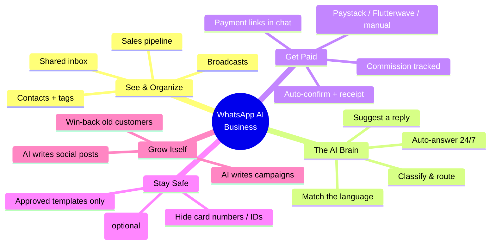
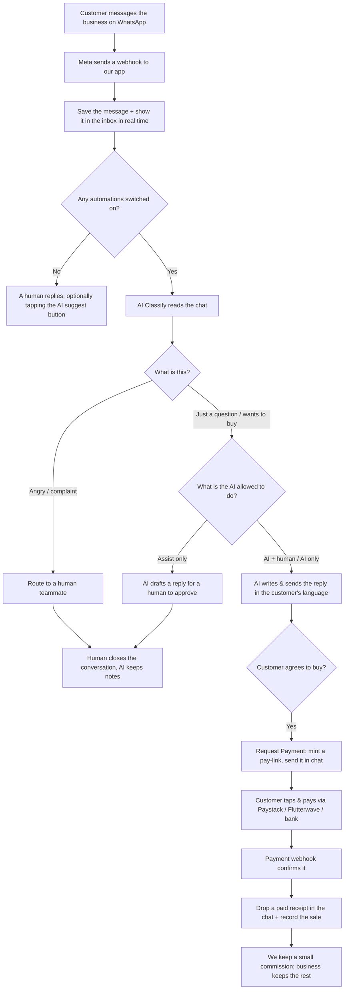
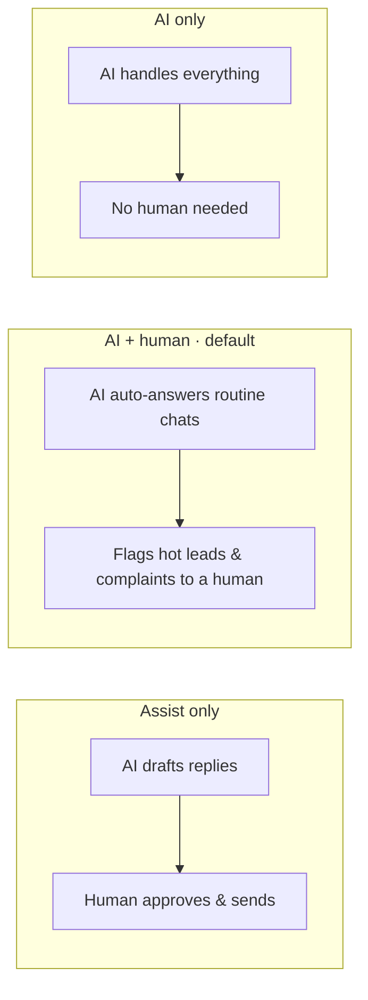
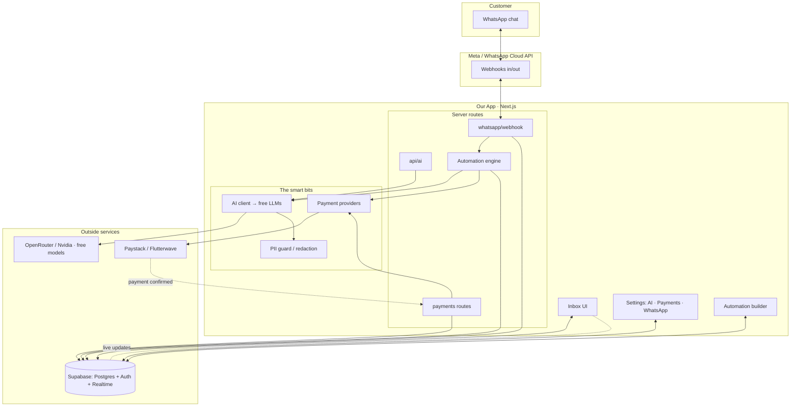
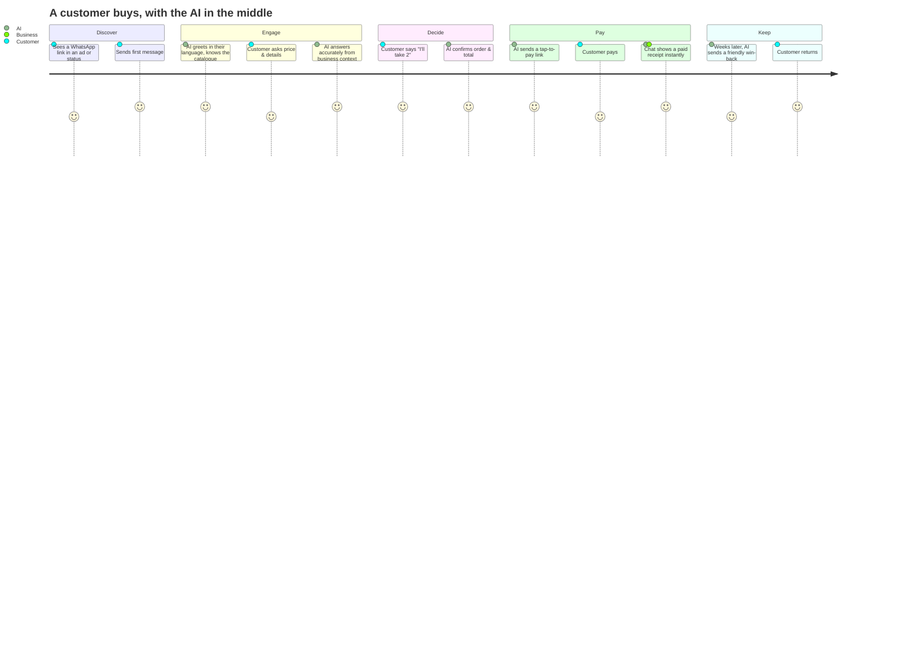
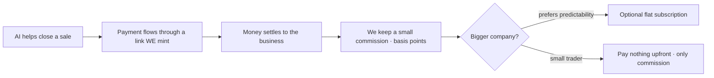

# What is this product, really?

> A plain-English map of what we've built, who it's for, and exactly how the
> pieces fit together to make money. If you ever feel lost, start here.

---

## 1. The one-sentence answer

**We sell an AI employee that lives inside a business's WhatsApp.** It reads
every message, replies in the customer's own language, figures out who's
ready to buy, collects the payment with a tap-to-pay link, and only
interrupts a human when one is truly needed.

The business keeps its customers and its money. We take a small slice of
each payment the AI helps collect — so we only win when they win.

---

## 2. Explain it like I'm 10

Imagine a lemonade stand where **every customer talks to you on WhatsApp** —
they message to ask the price, to order, and to pay.

Now imagine a **smart helper robot** that:

- 👀 **Watches** every message the moment it arrives, even at 2am.
- 🗣️ **Replies** in the language the customer used (English, Pidgin, Swahili,
  French…), and already knows your prices because you taught it once.
- 🧠 **Decides** what each message means — "wants to buy!", "angry, get a
  human!", "just a question".
- 💸 **Collects the cash** with a payment link in the chat, and pings you the
  moment it's paid.
- 🙋 **Calls a human** only when one is really needed.

**We built that robot.** Its brain runs on *free* AI, so even a tiny shop can
afford it. We earn a small cut of each sale the robot closes.

---

## 3. The two halves: filing cabinet + brain

The project has two layers. It helps to keep them separate in your head.

| Layer | What it is | Who built it |
| --- | --- | --- |
| **The filing cabinet** (base "wacrm") | A tidy place to *see* WhatsApp chats: shared inbox, contacts, sales pipeline, broadcasts, basic automations. It **stores and shows**. | The open-source template we started from. |
| **The brain + cash register** (our work) | The part that **acts on its own**: AI that reads/replies/decides, a payments rail that collects money, a privacy guard, and dials to control how much the AI does alone. | Us, this project. |

A filing cabinet is useful. A filing cabinet with a brain that runs the
business for you is a *superpower*. That's the leap we're building.

---

## 4. What a business actually gets (the features, grouped)



---

## 5. How one message flows through the system

This is the heartbeat of the product — what happens when a customer sends
"How much for 2 gowns?"



The key idea: **the AI doesn't just chat — it carries the customer all the
way from "how much?" to money in the bank**, and steps aside for a human
whenever the business wants.

---

## 6. The three ways a business can run the AI

Human-in-the-loop is the **default**, but every business picks its own
shape (Settings → AI):



A solo trader with no staff might choose **AI only**. A law firm might
choose **Assist only**. Most pick the middle. Same product, their rules.

---

## 7. How the pieces are put together (the architecture)



**Plain reading of the diagram:**
- The **customer** only ever sees WhatsApp.
- **Meta** is the postman carrying messages both ways.
- **Our app** is the shop's back office: the inbox a human sees, the
  settings, the automation builder, and the server "workers" that do the
  heavy lifting.
- The **smart bits** are reusable engines: the AI client (talks to *free*
  models), the privacy guard (hides card numbers before anything leaves),
  and the payment providers (mint links, take the fee).
- **Outside services**: free AI (OpenRouter/Nvidia), the payment gateways,
  and Supabase (our database + login + the live-updating inbox).

---

## 8. The customer journey, end to end



---

## 9. The business owner's journey (setup → running)

```mermaid
journey
    title Getting a business up and running
    section Set up once
      Connect WhatsApp number: 3: Owner
      Paste catalogue & prices into Settings → AI: 4: Owner
      Connect Paystack or bank details: 3: Owner
      Pick how much the AI does (assist / hybrid / auto): 5: Owner
    section Turn it on
      Add the "AI Close & Collect" automation: 5: Owner
      Flip it active: 5: Owner
    section Let it run
      AI answers & sells 24/7: 5: AI
      Owner handles only flagged chats: 4: Owner
      Money lands; receipts appear: 5: Owner, AI
    section Grow
      AI drafts broadcasts & social posts: 4: AI
      Win-back brings old customers back: 4: AI
```

---

## 10. How *we* (the platform) make money



- **No subscriptions for the little guy** — they hate/can't afford them. We
  take a small commission **only on money actually collected**.
- **Bigger companies** can opt into a flat plan instead.
- Our cost to run the AI is near **zero** (free models), so the math works
  even on tiny transactions.

Full detail: [`../STRATEGY.md`](../STRATEGY.md) §5.

---

## 11. Where every part lives in the code

| The part | Where it lives |
| --- | --- |
| AI brain (talks to free models) | `src/lib/ai/client.ts`, `src/lib/ai/prompts.ts` |
| AI endpoint (suggest/improve/campaigns) | `src/app/api/ai/route.ts` |
| Auto-answer & routing (the engine) | `src/lib/automations/engine.ts` |
| The automation builder UI | `src/components/automations/automation-builder.tsx` |
| Ready-made recipes (templates) | `src/lib/automations/templates.ts` |
| Payments brain | `src/lib/payments/` |
| Payment endpoints + webhook | `src/app/api/payments/` |
| Privacy guard | `src/lib/safety/pii.ts` |
| Business settings (AI, Payments) | `src/components/settings/` |
| WhatsApp connection + inbox | `src/app/api/whatsapp/`, `src/components/inbox/` |
| Database tables | `supabase/migrations/` |

---

## 12. What it is NOT (to avoid confusion)

- ❌ It is **not** a chatbot you bolt onto a website. It lives in the
  business's real WhatsApp, with real customers.
- ❌ It is **not** a spam blaster. It respects WhatsApp's rules (opt-in,
  approved templates, the 24-hour window).
- ❌ It is **not** "AI replaces everyone." Human-in-the-loop is the default;
  the AI removes the *boring* 80%, and hands the human the 20% that needs
  judgement.
- ❌ It is **not** an expensive enterprise tool. The brain is free to run, so
  it's built for a market that can't pay subscriptions.

---

## 13. The whole thing in three sentences

1. Businesses in Africa run on WhatsApp but drown in messages and lose
   sales overnight.
2. We give them an **AI employee** that answers, sells, and collects money
   in the chat 24/7 — with a human in the loop exactly as much as they
   want.
3. It costs them nothing upfront because the AI runs on free models, and we
   earn a small cut of every sale it closes — so our success is glued to
   theirs.
